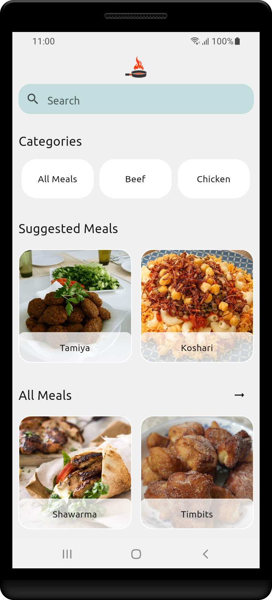
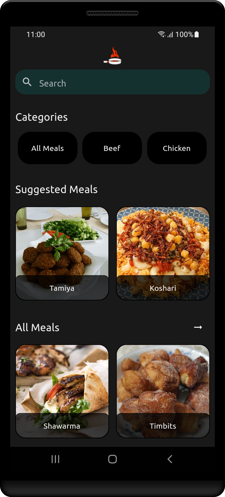
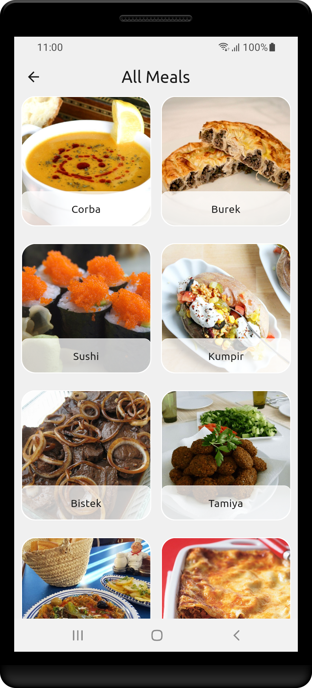
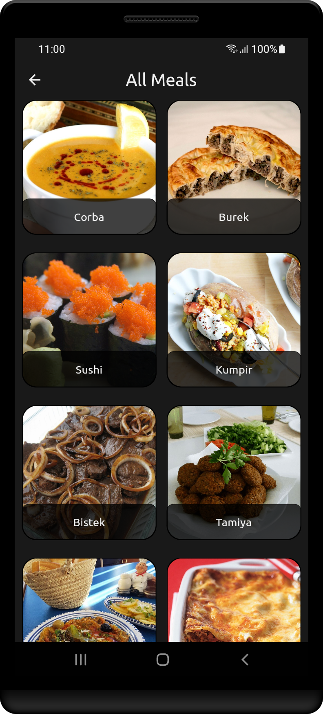
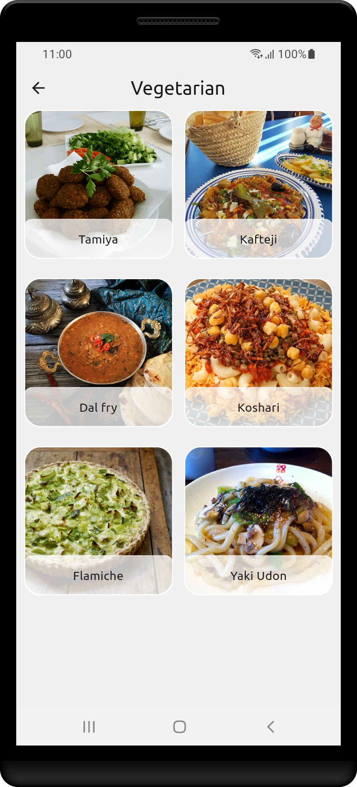
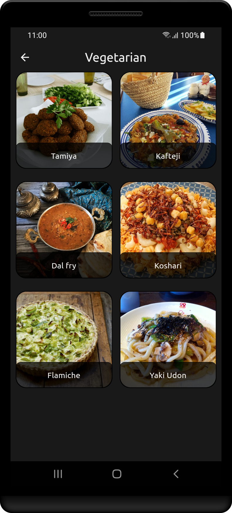
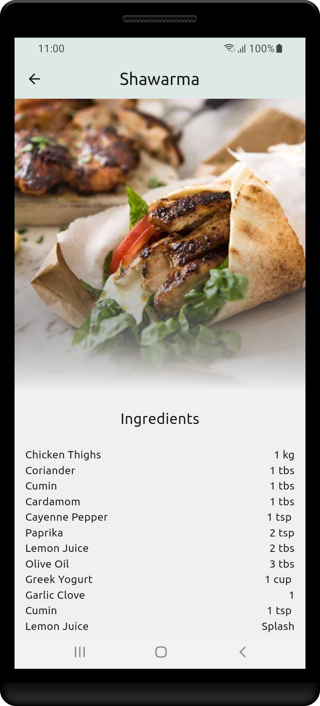
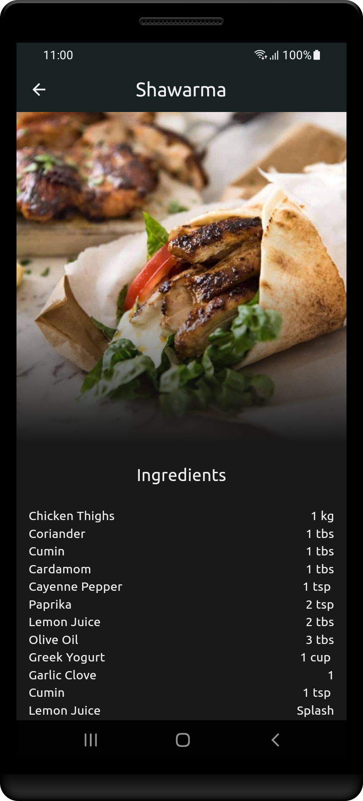

# Cookit - Dish Discoveries App

  

Cookit is a fantastic recipes app created using the Google's Flutter technology. With Cookit, you can easily discover and enjoy countless delicious recipes from around the world. This app makes it super simple to connect with a wide range of mouthwatering dishes, all in one place.

Explore a Variety of Tasty Dishes: Whether you're a fan of beef, chicken, or other categories, Cookit has you covered. You'll find an array of recipes to satisfy your cravings. 

## Key Features

- **MVVM Clean Architecture**: This project has been developed following the mvvm clean architecture pattern. This allows this app to be easily scaleable.

- **Real-Time Access**: Cookit fetches recipes from the popular website themealdb.com, ensuring you get up-to-date and tasty ideas whenever you're ready to cook.

- **Easy-to-Use Interface**: We've designed Cookit to be user-friendly, so you can quickly find recipes that suit your taste buds. No hassle, just deliciousness.

- **Start Your Culinary Adventure**: Embark on a culinary journey with Cookit as your guide. Experience the joy of cooking as you explore new flavors and create amazing dishes.

## App UI Gallery

  
  

  
  

  
  

  
  

## Flutter Packages Used

  - **flutter_riverpod**
  - **http**
  - **google_fonts**
  - **icons_launcher (dev)**
  - **flutter_native_splash (dev)**

